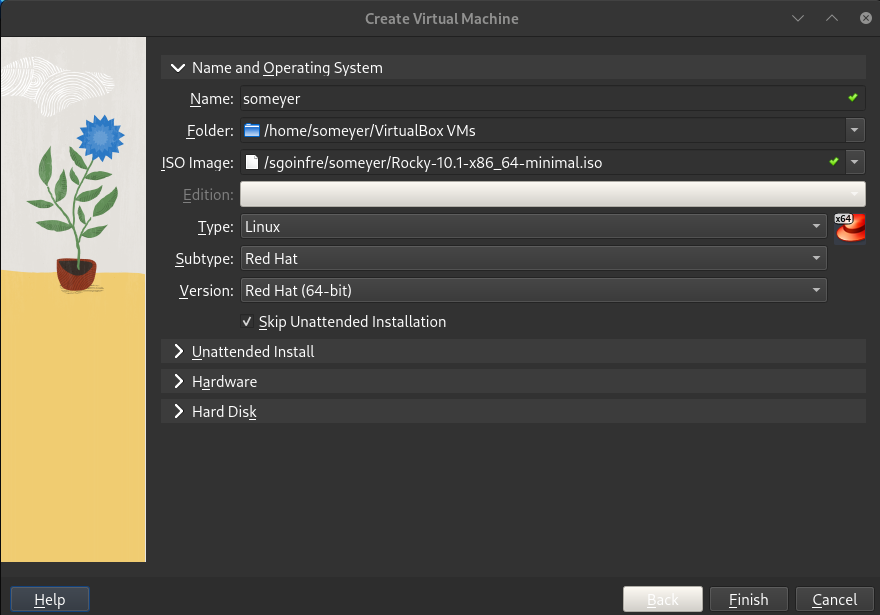
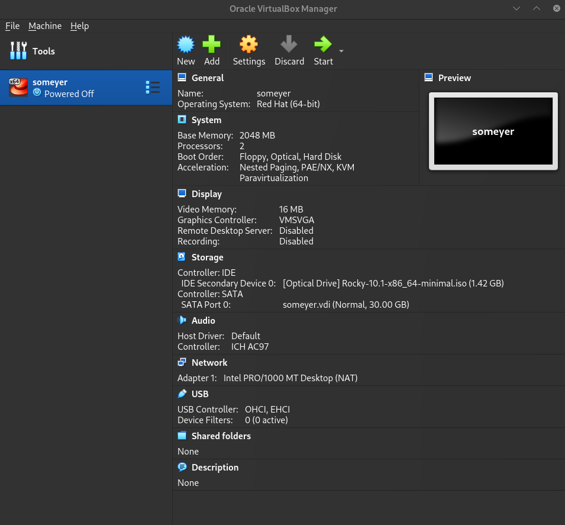
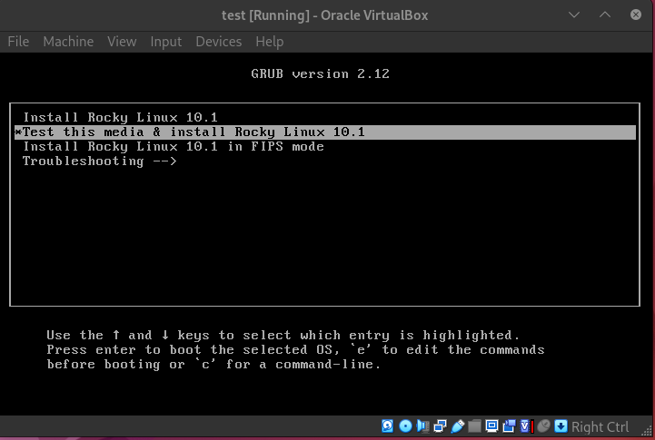
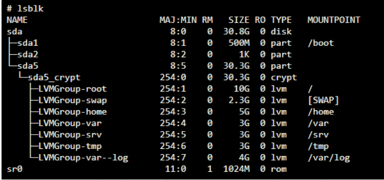

This project has been created as part of the 42 curriculum by <someyer>

# Description
### Born2beroot
This project is about setting up linux server (Rocky linux was chosen) by following specific rules.

...

# Instructions

## 1. Setting up Rocky using Oracle VirtualBox
First step is to create a virtual machine and install `Rocky linux` (minimal ISO can be downloaded [here](https://rockylinux.org/download). According to the project guidelines, we need a version without GUI interface, so minimal ISO is more then enough.

During the setup, you also need to configure hardware for the virtual machine. I gave **2 GB of RAM**, and **2 processors**, which is enough for my project (especially for minimal Rocky setup without GUI)

I also gave **31 GB** of space for my virtual Hard Disk.

<small>*I initially gave 30 GB, but after I noticed, that I'd need a little bit more space for my project needs, thats why I changed it to 31GB*</small>

Now click finish and your virtual machine is ready.

## 2. Rocky Installation

Now we can procees to Rocky installation.

Rocky has installer with GUI interface or just pure text version. 

*In my project I used both (after I noticed some troubles with text installer, I switched to GUI version to proceed with installation)*

At first step, when picture below appeared, I pressed `e` button end entered `inst.text` in the end of the line after `quiet` and pressed `Ctrl + x` to boot the installation.

When I entered, I pressed `alt + F2` to enter the shell, so I could manage my partitions according to project guidelines. For the reference, I needed to achieve this structure in the end:

When I entered the shell, I wanted to see how my hard disk is named, so I used `lsblk` command. My hard disk was named **sda** For managing partitions I used `fdisk`, there are other alternatives, like `parted`, but I already used fdisk before, so I chose to use it in this project.

For managing *sda* device, enter `fdisk /dev/sda` command. After that you can create/delete/edit partitions. I needed to created a new partition. For that case press `n` and `enter`

Now I needed to choose between primary / extended partition types. At first, I need to choose primary one, so press `p` and continue until you see the last sector. In the last sector I put 512 MiB (just enter `+512M`).

* *Note:* 
<small> During the installation, the system flagged 500 MiB as being below the recommended threshold for stability (that was the value from the project picture); I increased it to 512 MiB to ensure proper kernel updates and system boot reliability.</small>

Create the same way extended partition (press `e`) and continue with default size. After that, create it **one more time**, so you will end up with **sda5**, which will be encrypted further.

# Resources