This project has been created as part of the 42 curriculum by <someyer>

# Description
### Born2beroot
This project is about setting up linux server (Rocky linux was chosen) by following specific rules.

...

# Instructions

## 1. Setting up Rocky using Oracle VirtualBox
First step is to create a virtual machine and install `Rocky linux` (minimal ISO can be downloaded [here](https://rockylinux.org/download)). According to the project guidelines, we need a version without GUI interface, so minimal ISO is more then enough.

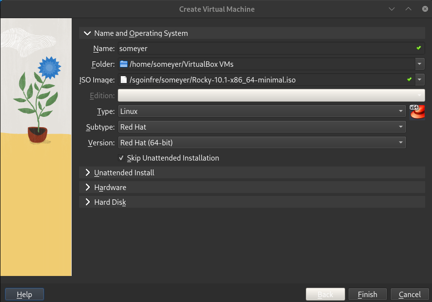

During the setup, you also need to configure hardware for the virtual machine. I gave **2 GB of RAM**, and **2 processors**, which is enough for my project (especially for minimal Rocky setup without GUI)

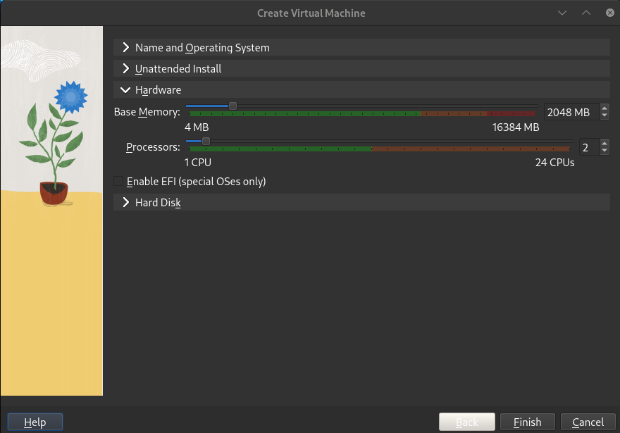

I also gave **31 GB** of space for my virtual Hard Disk.

<small>*I initially gave 30 GB, but after I noticed, that I'd need a little bit more space for my project needs, thats why I changed it to 31GB*</small>

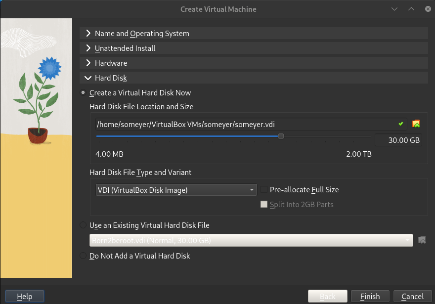

Now click finish and your virtual machine is ready.

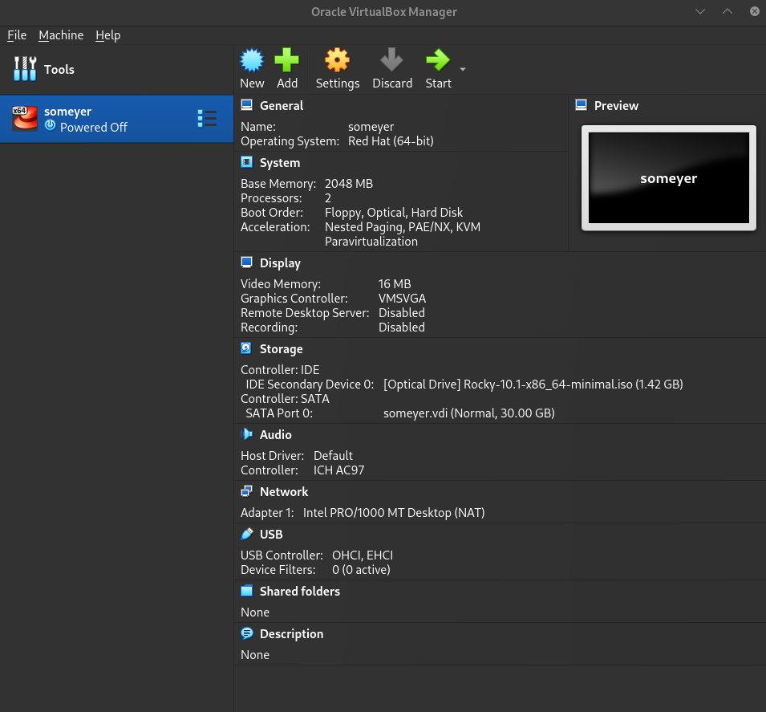

## 2. Rocky Installation

Now we can procees to Rocky installation.

Rocky has installer with GUI interface or just pure text version. 

*In my project I used both (after I noticed some troubles with text installer, I switched to GUI version to proceed with installation)*

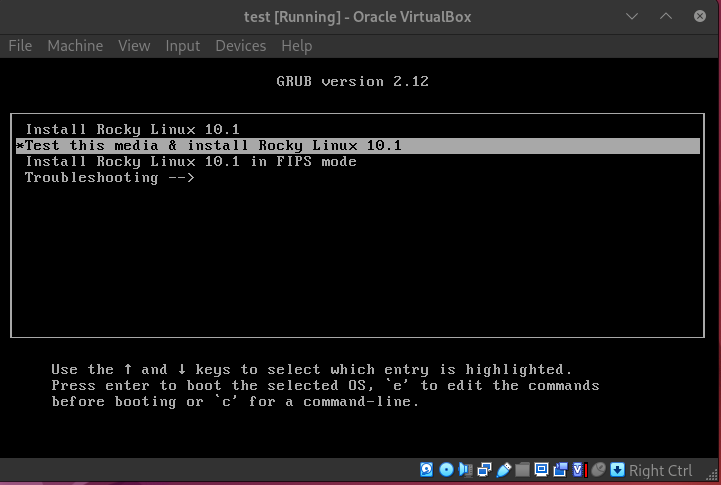

At first step, when picture below appeared, I pressed `e` button end entered `inst.text` in the end of the line after `quiet` and pressed `Ctrl + x` to boot the installation.

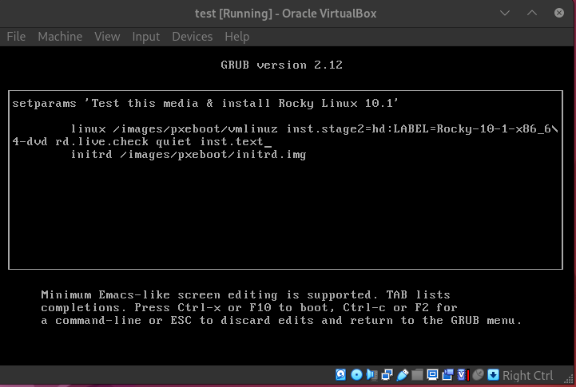

When I entered, I pressed `alt + F2` to enter the shell, so I could manage my partitions according to project guidelines. For the reference, I needed to achieve this structure in the end:

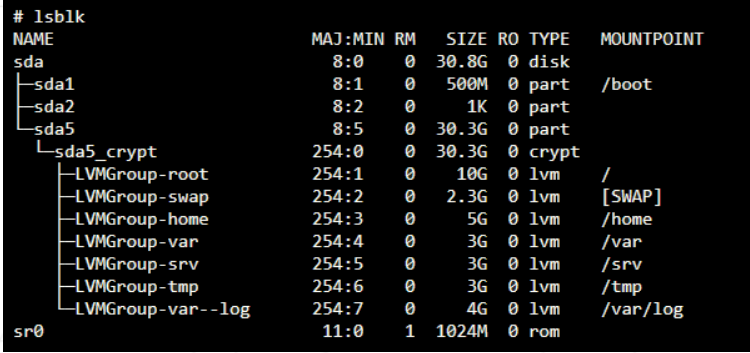

When I entered the shell, I wanted to see how my hard disk is named, so I used `lsblk` command. My hard disk was named **sda** For managing partitions I used `fdisk`, there are other alternatives, like `parted`, but I already used fdisk before, so I chose to use it in this project.

For managing *sda* device, enter `fdisk /dev/sda` command. After that you can create/delete/edit partitions. I needed to created a new partition. For that case press `n` and `enter`

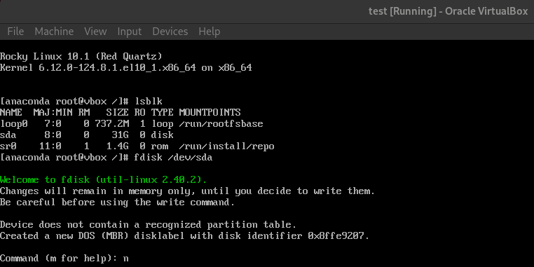

Now I needed to choose between primary / extended partition types. At first, I need to choose primary one, so press `p` and continue until you see the last sector. In the last sector I put 512 MiB (just enter `+512M`).

* *Note:* 
<small> During the installation, the system flagged 500 MiB as being below the recommended threshold for stability (that was the value from the project picture); I increased it to 512 MiB to ensure proper kernel updates and system boot reliability.</small>

Create the same way extended partition (press `e`) and continue with default size. After that, create it **one more time**, so you will end up with **sda5**, which will be encrypted further.

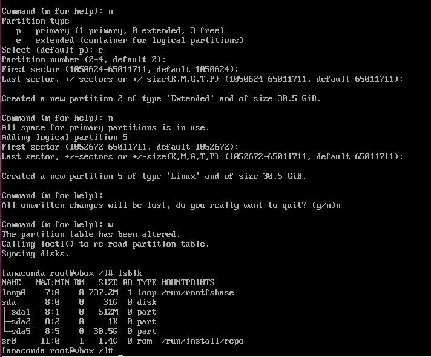

After you achieved similar structure, you can continue with disk encrypting. I encrypted it using LUKS format. Enter the following command:
```bash
cryptsetup luksFormat --type luks1 /dev/sda5
```

After that sda5 disk will be encrypted in LUKS format.

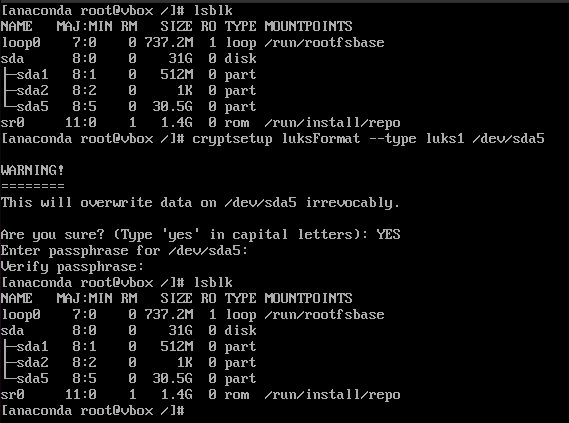

Now if you want to see the result, you need to open encrypted disk and enter your passphrase.

```bash
cryptsetup open /dev/sda5 sda5_crypt
```

Now you can enter ```lsblk``` command and see the result.

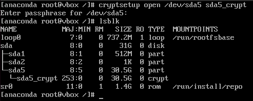

After that, create a physical volume inside our crypted container.

```bash
pvcreate /dev/mapper/sda5_crypt
```

Create LVMGroup volume group.

```bash
vgcreate LVMGroup /dev/mapper/sda5_crypt
```

Create root and swap logical volumes in LVMGroup.

```bash
lvcreate -L 10G LVMGroup -n root
```

```bash
lvcreate -L 2.3G LVMGroup -n swap
```


Now we need to format root in ext4 format, swap in swap format.

```bash
mkfs.ext4 /dev/LVMGroup/root
mkswap /dev/LVMGroup/swap
```

 Power off the machine and start again in GUI mode, where we can do the rest of installation. If you are failed to boot, just choose your ISO file.

* *Note:* 
<small> I tried to continue in text installation regime, but I had problems to configure mountpoints. I haven't found what was the issue. In GUI installator there is a straightforward way how to enter mountpoints and I didn't have any issues so I chose this variant. </small>

Enter GUI installation continue to ```Installation Destination```, click on available hard disk and choose ```Custom``` configuration option and continue.

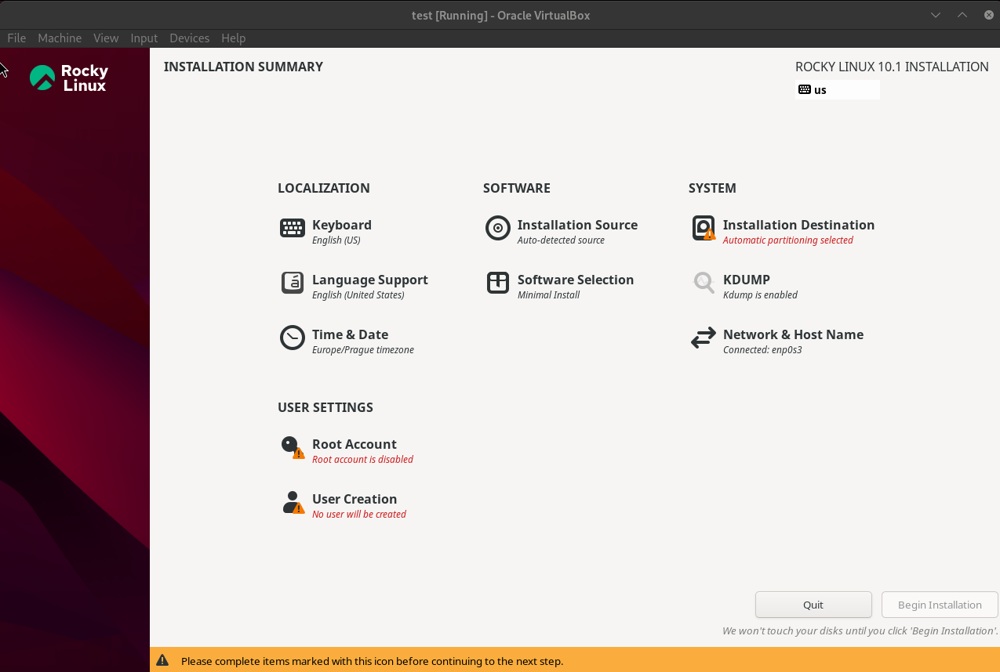
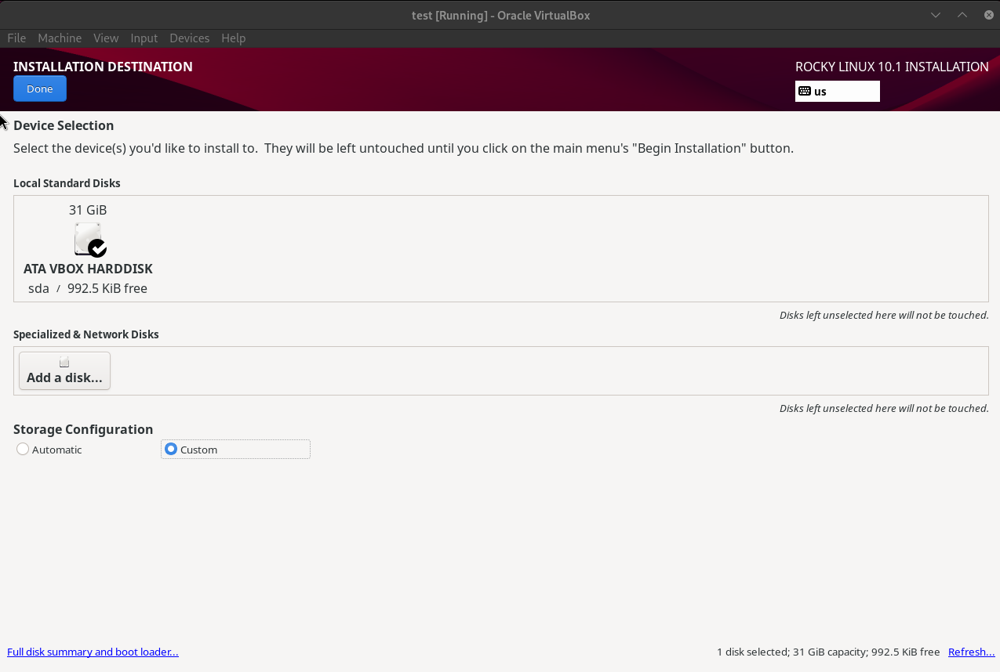

Unlock your encrypted disk and enter passphrase.

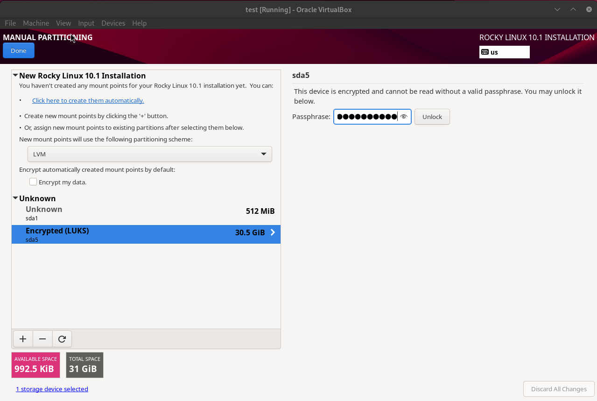

Now, under ```Unknown``` there's nothing we can do with ```sda1```. It's not a big deal, delete it, we will create it again later.

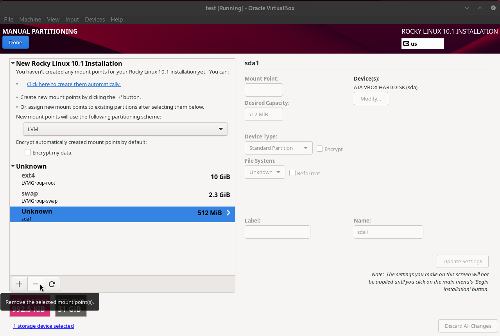

Click on ```root```, reformat it in ext4 and assign ``` '/' ``` mount point. You must reformat, otherwise you will catch an error.

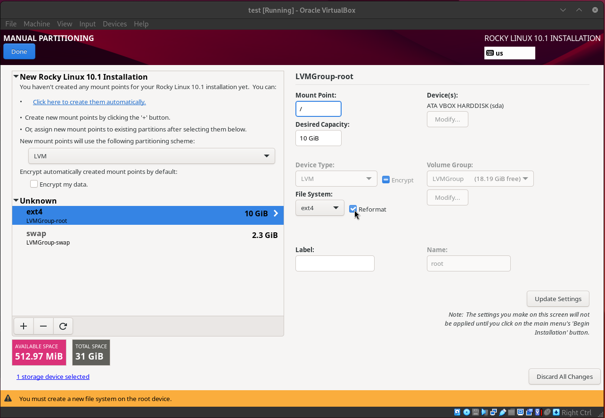

After that, reformat ```swap``` in swap format.

Click on plus button and enter ```/boot``` mountpoint, give it ```512M``` as we did it before. Reformat it in ext4 after it's done.

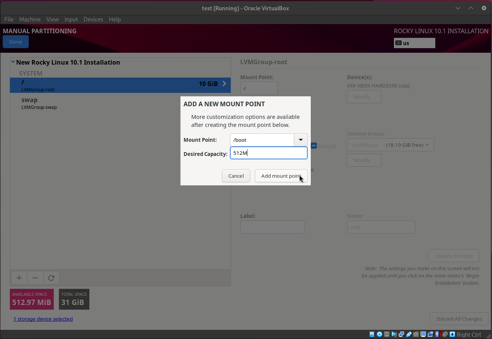


* *Note:*
If you'll try to continue, program could ask you to create ```biosboot``` mountpoint and give it ```1MiB``` of space. Do that for continuing installation. 

Now click ```Done``` and accept all of your changes.

Click on KDump and choose automatic option.

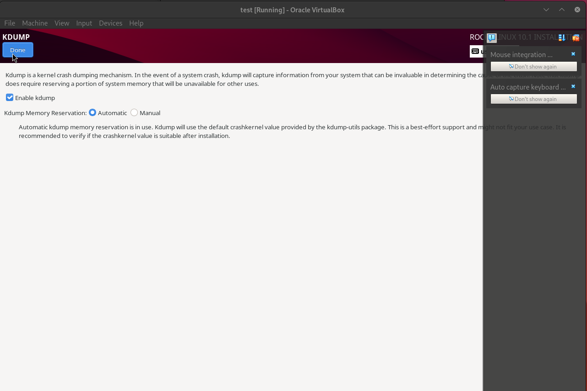
After that, you need to enable root account. Accessing root account via SSH should be disabled.

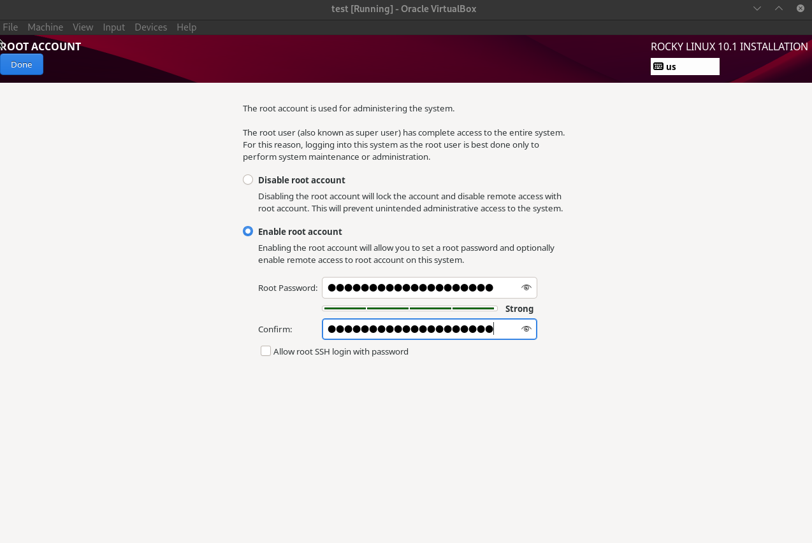

Finally, you are done! Click on ```Begin installation``` and have a cookie!

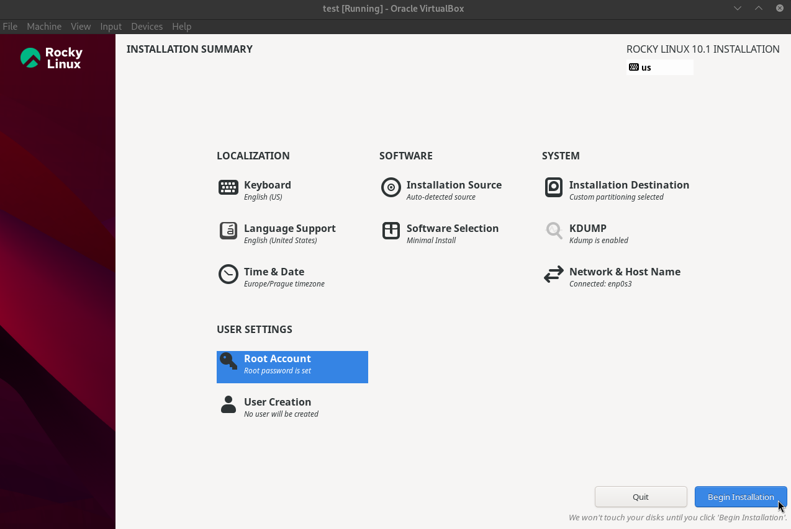

## 3. Post installation

After we done, boot your system and login to your **root account**.

After installation, we need to add other logical volumes in our LVMGroup and mount them.

Let's create those logical volumes:

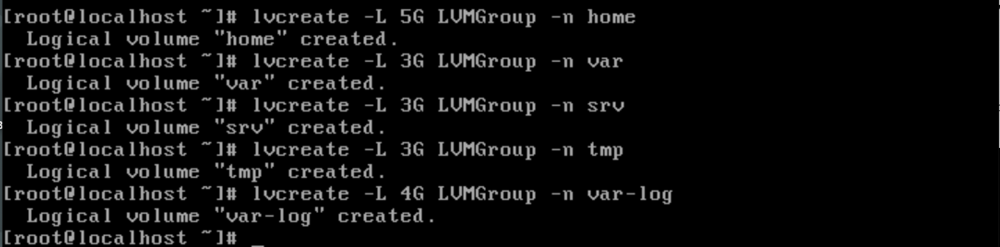

Now, when you execute ```lsblk``` command you will see this result:

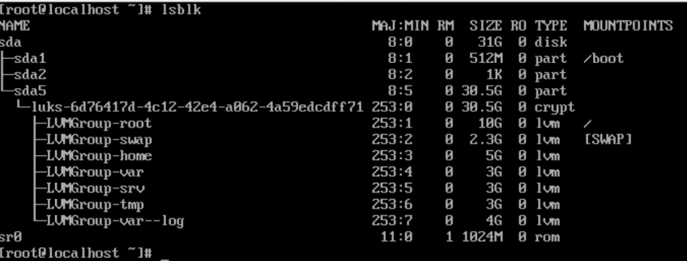

These volumes need to be formatted and mounted. Let's do that with following commands:

```bash
mkfs.ext4 /dev/LVMGroup/home
mkfs.ext4 /dev/LVMGroup/var
mkfs.ext4 /dev/LVMGroup/srv
mkfs.ext4 /dev/LVMGroup/tmp
mkfs.ext4 /dev/LVMGroup/var-log
```

After formatting, let's mount devices:

```bash
mount /dev/LVMGroup/home /home
mount /dev/LVMGroup/var /var
mount /dev/LVMGroup/srv /srv
mount /dev/LVMGroup/tmp /tmp
mkdir /var/log
mount /dev/LVMGroup/var-log /var/log
```

After you write ```lsblk``` command, result will be:


In the next step, we want our system to do this mounting automatically. For that we can configure /etc/fstab file.

* *Note:*  This file is critical, if you make a mistake, system could stop booting, so be cautious during the configuration.

```bash
vi /etc/fstab
```

Write these configurations down below. Don't change anything what is already there:

```
/dev/mapper/LVMGroup-root /     ext4 defaults 0 0
/dev/mapper/LVMGroup-home /home ext4 defaults 0 0
/dev/mapper/LVMGroup-var /var   ext4 defaults 0 0
/dev/mapper/LVMGroup-srv /srv   ext4 defaults 0 0
/dev/mapper/LVMGroup-tmp /tmp   ext4 defaults 0 0
/dev/mapper/LVMGroup-var--log /var/log ext4 defaults 0 0
```

* *Note:* I used device names here to keep things simple for this demo. In a real project, it’s better to use UUIDs (unique IDs). Device names can change if you plug in new hardware, which can break your setup. UUIDs never change.

In result you will be having something like this:


Now we can check for errors using:

```bash
mount -a
```

If you **didn't catch any error** - that's good, we can reboot now and check if everything works. If you have errors, then check your /etc/fstab file again.

```bash
reboot
```

Let's check if our partitions are still correct:


Great! We have all partitions part done! Now we can continue with our project.

## 4. Open-SSH configuration